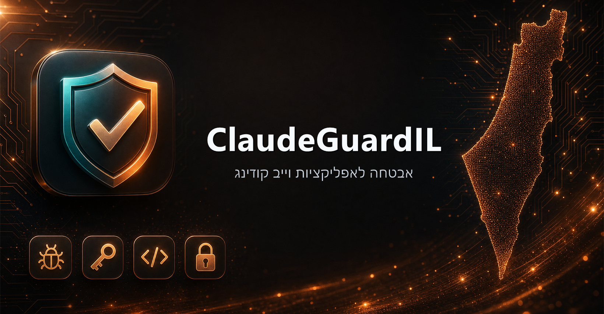

<div dir="rtl">

# 🛡️ ClaudeGuardIL



<div align="center">

## קלוד — הקהילה הישראלית

</div>

**כלי אבטחה לאפליקציות vibecoding.** מפנים אותו לפרויקט ומקבלים דוח מדורג של פרצות אבטחה אמיתיות
עם ראיות, ולצידן קוד הגנה מוכן להדבקה — לאתרים ואפליקציות web, פיצ'רים של AI/LLM,
Supabase/Firebase, אנדרואיד, iOS, Electron, backend/IaC ו-CI/CD.

> **פרויקט קהילתי — אינו מוצר רשמי של Anthropic.**
> נבנה עבור [קהילת Claude הישראלית](https://www.facebook.com/groups/cladue).

**מה המספרים אומרים, לפני שמצטטים אותם.** שער הבנצ'מרק עומד על **אפס רגרסיות ב-18 ממצאים מקובעים
בשבעה תרחישים פגיעים, ואפס ממצאים מאושרים בלתי צפויים בשמונה גרסאות תקינות** — קורפוס שהפרויקט הזה
כתב בעצמו. זו הגנה אמיתית מפני רגרסיה ושער אמיתי נגד התרעות שווא. **שיעור הגילוי בעולם האמיתי טרם
נמדד.** ניסוח קודם פתח ב-"recall 100% / precision 100%", שנקרא כטענה על שיעור גילוי — והוא
טאוטולוגיה בבנצ'מרק מסוג golden file. הטענה בוטלה בגלוי ומתועדת כ-**ERR-006**
ב-[`ERRATA.md`](ERRATA.md); מה שיכול לשנות את זה נמצא ב-[`ROADMAP.md`](ROADMAP.md).

---

## למה זה נבנה

מפתחים ב-vibecoding משחררים מהר עם Claude Code, Cursor, Lovable, Base44, Bolt ו-v0 — ואגב כך
חושפים מפתחות `service_role`, מעלים אפליקציות בלי RLS ב-Supabase, שמים מפתחות API של LLM בצד
הלקוח, ומעלים קבצי `.env` ל-git. הקהילה כבר מתמודדת עם זה בשטח. הכלי הזה מוצא את הבעיות **ומייצר
את ההגנות**.

## שתי דרכים להשתמש

### 1) תוסף ל-Claude Code (מנוע מלא)
סורק את כל ה-repo, מריץ סורקים, ויכול לייצר ולהחיל תיקונים.

<div dir="ltr">

```
/plugin marketplace add Freespirits/claudeguard-il
/plugin install claudeguard-il@claudeguard-il
```

</div>

ואז, בתוך הפרויקט:

<div dir="ltr">

```
/cg-scan            # בדיקה סטטית (Tier 0) — בטוחה, קריאה בלבד, ברירת המחדל
/cg-intent          # בניית/תיקון claudeguard.intent.yml בכמה שאלות פשוטות — הופך את
                    #   ביקורת הלוגיקה העסקית מניחוש לבדיקה
/cg-harden          # ייצור קוד הגנה מוכן להדבקה
/cg-fix             # החלת ההגנות (קודם diff יבש, אתם מאשרים)
/cg-live  <url>     # Tier 1 בדיקות live פסיביות (יעד שבבעלותכם)
/cg-dast  <url>     # Tier 2 בדיקות אקטיביות — בדיקת עשן (יעד שבבעלותכם + הרשאה)
```

</div>

### 2) Skill ל-claude.ai / Claude Desktop (ידע + דוח)
למי שלא עובד בטרמינל. בונים את קובץ ה-zip ומעלים אותו ב-claude.ai (הגדרות → יכולות → Skills):

<div dir="ltr">

```
node scripts/build.mjs          # מייצר claudeguard-skill.zip
```

</div>

ואז מדביקים או מעלים את הקוד/קונפיג ושואלים: *"בדוק את האבטחה של האפליקציה"*. אותו ידע, אותו דוח
דו-לשוני; בלי סריקת repo, subagents או תיקון אוטומטי.

---

## שלוש רמות בדיקה

| רמה | מה | בטיחות |
|------|------|--------|
| **0 · סטטית** | קורא קוד, קונפיג, תלויות, `.env`, RLS, manifests, היסטוריית git. | ברירת מחדל. בלי רשת, בלי סיסמאות. |
| **1 · live פסיבית** | בדיקות קריאה-בלבד על URL חי (TLS, headers, cookies, קבצים חשופים). | דורש `claudeguard.scope.yml` עם הצהרת בעלות. GET/HEAD בלבד. |
| **2 · בדיקות אקטיביות** | ארבע בקשות GET מול URL חי: בדיקת החזרת markup, גרש בודד בפרמטר `id`, בדיקת open-redirect, ובדיקת כותרת CSP. **זו בדיקת עשן, לא סורק** — בלי crawling, בלי זרימות מאומתות, בלי גילוי פרמטרים, בלי IDOR, בלי fuzzing. לבדיקת DAST אמיתית השתמשו ב-Burp, ZAP או Nuclei. | דורש הצהרת הרשאה-בכתב + בעלות, רשימת יעדים מותרים, הגבלת קצב; dry-run כברירת מחדל. |

> **על השם של Tier 2.** גרסה קודמת של הטבלה תיארה את Tier 2 כ"תעבורת תקיפה אמיתית (injection, IDOR,
> fuzzing)". זה מעולם לא היה נכון — הוא שולח את ארבע הבקשות שלמעלה, ואין בו בדיקת IDOR כלל. הטענה
> מצוטטת ומבוטלת בגלוי ולא נמחקת בשקט: **ERR-004** ב-[`ERRATA.md`](ERRATA.md). ראו
> [`ROADMAP.md`](ROADMAP.md) לגבי מה שבדיקה דינמית אמיתית הייתה דורשת.

מעתיקים את `core/authorization/SCOPE.example.yml` ל-`claudeguard.scope.yml` וממלאים כדי להפעיל את
Tier 1–2. **בודקים רק מערכות שבבעלותכם או שיש לכם הרשאה בכתב לבדוק.**

## מה הוא בודק

סודות בצד הלקוח/ב-repo · RLS ו-`service_role` ב-Supabase · חוקי Firebase · אימות והרשאות ו-IDOR ·
ולידציה של קלט · injection מסוג SQL/XSS/SSRF · security headers/CORS/cookies · הגבלת קצב ·
**סיכוני LLM** (חשיפת מפתח, prompt injection, ניצול כלים של agent, DoS עלות) · manifest ואחסון
באנדרואיד/iOS · בידוד ו-IPC ב-Electron · Docker/K8s/Terraform · GitHub Actions ו-supply-chain.

## בנוי למי שלא מומחה (עברית פשוטה)

הקהל הוא אנשים שבנו אפליקציה אמיתית עם כלי AI ומעולם לא למדו אבטחה. לכן כל ממצא בדוח נפתח בשורת
**"בפשטות"** — בלי ז'רגון, לפני כל הסבר טכני: מה בדיוק חשוף, למה זה חשוב, ומה הדבר האחד שכדאי לעשות.
בנוסף יש מדריך למתחילים, [`core/plain-language/concepts.he.md`](core/plain-language/concepts.he.md),
שמלמד את הרעיונות פעם אחת בעברית פשוטה — המודל של דפדפן מול שרת, `service_role` מול המפתח האנונימי,
RLS, IDOR, prompt injection ו-denial of wallet — בלי קשר לסריקה מסוימת. הטקסט של כל ממצא נמצא ב-
[`core/plain-language/findings.md`](core/plain-language/findings.md), לפי מזהה הממצא, ומגיע גם לתוסף
וגם ל-skill.

## איך זה בנוי

`core/` הוא מקור האמת היחיד (markdown פשוט). `scripts/build.mjs` מעתיק אותו לשני העטיפות, כך
שעריכה אחת מעדכנת גם את התוסף וגם את ה-skill. מנוע הסריקה הוא **היברידי**: משתמש ב-
`gitleaks` / `semgrep` / `npm audit` כשהם מותקנים, ונופל בחזרה לקריאת קוד ע"י Claude כשלא — ולעולם
לא מתקין כלום בכפייה.

## למה יש כאן "אפליקציה פגיעה"?

`sample-vulnerable-app/` היא **פיקסצ'ר בדיקה מכוון** — היא קיימת רק כדי להריץ עליה את הכלי מול קוד
פגיע ידוע. הבעיות שלה הן ברמת ה**קוד** (מפתח `service_role` חשוף, חוסר RLS, IDOR, prompt injection,
חוסר headers). ה**תלויות שלה אינן מעודכנות**, ולכן היא כן מפעילה התראות Dependabot — כל התראה
במאגר הזה מצביעה על פיקסצ'ר, ואף אחת מהן אינה נגישה מהקוד שהכלי מפיץ. לעולם אל תפרסו אותה.
ראו [`SECURITY.md`](SECURITY.md), ו-**ERR-002** ב-[`ERRATA.md`](ERRATA.md) לגבי הטענות הסותרות
שהתיעוד נשא בעבר על אותן תלויות.

## יומן תיקונים (Errata)

טענות שהפרויקט הזה טען ומצא שהן שגויות מבוטלות בגלוי, ממוספרות ונשמרות: [`ERRATA.md`](ERRATA.md).
כרגע יש בו שש רשומות — שער שבדק כתובת אחת ופנה לאחרת (ERR-001), הטענות על תלויות הפיקסצ'רים
(ERR-002), דליפת מפתח בבדיקה החיה שלנו עצמה שנמצאה בביקורת חיצונית (ERR-003), הניפוח של Tier 2
(ERR-004), החצי מהתיקון ההוא שהוכרז לפני שבוצע (ERR-005), והכותרת של הבנצ'מרק (ERR-006).

היומן קיים כי הכשל שהכלי הזה נבנה כדי לתפוס — אמירה בטוחה שאף אחד לא בדק — הוא כשל שגם אנחנו
חוזרים עליו. שום דבר לא נמחק בשקט, וכל רשומה מצטטת את הטענה המקורית.

## כתב ויתור

מסופק כמות שהוא, ללא אחריות. דוח נקי **אינו** הוכחה לבטיחות. אתם אחראים על מה שאתם סורקים ועל
ההיקף של כל בדיקת live/DAST. אין קשר ל-Anthropic. רישיון MIT.

</div>
